<!-- ╔══════════════════════════════════════════════════════════════════════════╗ -->
<!-- ║                    DEEP REINFORCEMENT LEARNING · ODS.ai 2023               ║ -->
<!-- ╚══════════════════════════════════════════════════════════════════════════╝ -->

<div align="center">


<h1>🧠 &nbsp;Deep Reinforcement Learning &nbsp;🎮</h1>

<h3><i>From the Cross-Entropy Method to Soft Actor-Critic</i></h3>

<p>
<b>A complete, hands-on journey through model-free & model-based Deep RL —</b><br/>
tabular control, value-function approximation, and modern actor-critic policy gradients.
</p>

<!-- ─────────────────────────────  IDENTITY BADGES  ───────────────────────────── -->


-0F9D58?style=for-the-badge)


</div>

---

<!-- ══════════════════════════════════════════════════════════════════════════════ -->
<!--                          CERTIFICATE OF COMPLETION                             -->
<!-- ══════════════════════════════════════════════════════════════════════════════ -->

<div align="center">

<table width="82%">
<tr>
<td align="center">

<br/>

### 📜 &nbsp; CERTIFICATE OF COMPLETION &nbsp; 📜

`— OPEN DATA SCIENCE · DEEP REINFORCEMENT LEARNING PROGRAM —`

<br/>

This certifies that the author successfully completed the intensive graduate-level

**Deep Reinforcement Learning** course, comprising **8 theoretical lectures**, **7 guided
practical sessions**, and **11 graded homework assignments** — designing, implementing, and
training reinforcement-learning agents from first principles in `PyTorch`.

<br/>

> 🏅 &nbsp;Upon completion, the author was **invited to join the teaching staff of the second
> cohort** of the Deep Reinforcement Learning course as a **Teaching Assistant**, mentoring
> new students and reviewing their reinforcement-learning implementations.

<br/>

|  |  |
|:--|:--|
| **Program** | Deep Reinforcement Learning |
| **Institution** | Open Data Science community · <code>ods.ai</code> |
| **Lecturer** | **Anton Plaksin** — Researcher, Yandex Research group · Associate Professor, Ural Federal University · Senior Researcher, IMM UB RAS |
| **Cohort** | 2023 (`ODSRL23`) |
| **Scope** | 8 Lectures · 7 Practicals · 11 Homeworks |
| **Distinction** | Invited as Teaching Assistant for Cohort II |

<br/>

</td>
</tr>
</table>

</div>

---

## 📖 &nbsp;Table of Contents

1. [Abstract](#-abstract)
2. [Curriculum — Program of Study](#️-curriculum--program-of-study)
3. [Course Structure Diagram](#-course-structure-diagram)
4. [Algorithmic & Mathematical Arsenal](#-algorithmic--mathematical-arsenal)
5. [Milestone Deep-Dive](#-milestone-deep-dive)
6. [Headline Results](#-headline-results)
7. [Technology Stack](#️-technology-stack)
8. [Repository Layout](#️-repository-layout)
9. [References & Further Reading](#-references--further-reading)

---

## 🎯 &nbsp;Abstract

> Reinforcement Learning studies **agents** that learn to act optimally in an **environment**
> purely from the **reward** signal produced by their own experience. Formally, the interaction
> is a **Markov Decision Process** $\langle \mathcal{S}, \mathcal{A}, P, R, \gamma \rangle$, and
> the agent seeks a policy $\pi_\theta(a \mid s)$ maximizing the expected discounted return
>
> $$J(\pi_\theta) \;=\; \mathbb{E}_{\tau \sim \pi_\theta}\!\left[\, \sum_{t=0}^{\infty} \gamma^{t}\, R_t \,\right], \qquad \gamma \in [0, 1].$$

This repository documents my complete body of work for the course: every implemented
algorithm, every trained agent, and the empirical results obtained on classic control and
Box2D benchmarks. The trajectory of the course moves deliberately from **derivative-free
optimization** (Cross-Entropy) through **exact dynamic programming**, into **tabular
temporal-difference control**, and finally to **deep function approximation** and
**modern policy-gradient actor-critics** (PPO, SAC) — the algorithmic backbone behind
breakthrough results on Atari, Go, and StarCraft II.

---

## 🗂️ &nbsp;Curriculum — Program of Study

The program is organized as **eight thematic milestones**. Each milestone couples an **oral
lecture** (theory), a **practical session** (guided implementation), and a **take-home
assignment** (independent implementation, tuning, and empirical evaluation).

| # | Milestone Topic | Core Algorithms | Benchmark Environments |
|:-:|:----------------|:----------------|:-----------------------|
| **I** | Foundations · Cross-Entropy Method | Tabular CEM, elite selection, policy smoothing | `Taxi-v3` |
| **II** | Neural Networks · Deep Cross-Entropy | Deep CEM with neural policy | `LunarLander-v2`, `Pendulum-v1`, `MountainCarContinuous-v0` |
| **III** | Dynamic Programming | Policy Iteration, Value Iteration | `FrozenLake` |
| **IV** | Model-Free Prediction & Control | Monte-Carlo, SARSA, Q-Learning | `Taxi-v3`, `CartPole-v1`, `Acrobot-v1`, `MountainCar-v0` |
| **V** | Value Function Approximation | DQN, Double DQN, Hard/Soft Target Update | `LunarLander-v2` |
| **VI** | Policy Gradient · On-Policy | Actor-Critic, Advantage, **PPO** | `Pendulum-v1`, `LunarLander-v2`, `Acrobot-v1` |
| **VII** | Policy Gradient · Off-Policy | DDPG, TD3, **SAC** (entropy-regularized) | `LunarLander-v2` |
| **VIII** | Exploration | Multi-Armed Bandits, ε-greedy, UCB, Thompson Sampling | *theoretical capstone* |

---

## 🧭 &nbsp;Course Structure Diagram

> Each **milestone block** branches into its three pillars — 🎓 **Lesson** (theory),
> 🧪 **Practice** (guided lab), and 🏋️ **Homework** (independent implementation + results).
> The spine flows top-to-bottom through the eight stages of the curriculum.

```mermaid
flowchart TB
    classDef lesson    fill:#1e3a8a,stroke:#60a5fa,stroke-width:2px,color:#ffffff;
    classDef practice  fill:#065f46,stroke:#34d399,stroke-width:2px,color:#ffffff;
    classDef homework  fill:#7c2d12,stroke:#fb923c,stroke-width:2px,color:#ffffff;

    %% ───────────── MILESTONE I ─────────────
    subgraph M1["🟣 I · Cross-Entropy Method"]
        direction LR
        L1["🎓 Lecture 1<br/>Intro to RL · MDP formalism<br/>Cross-Entropy Method"]:::lesson
        P1["🧪 Practice 1<br/>Tabular CEM agent<br/>elite-trajectory selection"]:::practice
        H1["🏋️ Homework 1<br/>CEM on Taxi-v3<br/>Laplace + policy smoothing,<br/>deterministic policy sampling<br/>reward ≈ 7.15"]:::homework
    end

    %% ───────────── MILESTONE II ─────────────
    subgraph M2["🟣 II · Deep Cross-Entropy"]
        direction LR
        L2["🎓 Lecture 2<br/>Neural Networks · Perceptron<br/>Deep Cross-Entropy Method"]:::lesson
        P2["🧪 Practice 2<br/>Neural policy + Deep CEM<br/>discrete and continuous control"]:::practice
        H2["🏋️ Homework 2<br/>Deep CEM on LunarLander-v2<br/>+ Pendulum, MountainCarContinuous<br/>reward ≈ 148.9 · video capture"]:::homework
    end

    %% ───────────── MILESTONE III ─────────────
    subgraph M3["🟣 III · Dynamic Programming"]
        direction LR
        L3["🎓 Lecture 3<br/>Dynamic Programming<br/>Policy and Value Iteration<br/>Bellman equations"]:::lesson
        P3["🧪 Practice 3<br/>Policy / Value Iteration<br/>on Frozen Lake"]:::practice
        H3["🏋️ Homework 3<br/>Policy Iteration on Frozen Lake<br/>gamma-sensitivity study,<br/>warm-started evaluation"]:::homework
    end

    %% ───────────── MILESTONE IV ─────────────
    subgraph M4["🟣 IV · Model-Free Control"]
        direction LR
        L4["🎓 Lecture 4<br/>Monte-Carlo · SARSA<br/>Q-Learning · TD learning"]:::lesson
        P4["🧪 Practice 4<br/>epsilon-greedy control<br/>temporal-difference updates"]:::practice
        H4["🏋️ Homework 4.1 + 4.2<br/>Q-Learning vs CEM/MC/SARSA on Taxi-v3;<br/>discretized Acrobot/CartPole/<br/>MountainCar/LunarLander vs Deep CEM"]:::homework
    end

    %% ───────────── MILESTONE V ─────────────
    subgraph M5["🟣 V · Value Function Approximation"]
        direction LR
        L5["🎓 Lecture 5<br/>Function approximation · DQN<br/>experience replay · target networks"]:::lesson
        P5["🧪 Practice 5<br/>Deep Q-Network<br/>implementation"]:::practice
        H5["🏋️ Homework 5.1 + 5.2<br/>DQN on LunarLander-v2 (~253)<br/>Hard/Soft Target Update, Double DQN (~305)<br/>W and B hyper-parameter sweeps"]:::homework
    end

    %% ───────────── MILESTONE VI ─────────────
    subgraph M6["🟣 VI · Policy Gradient · On-Policy"]
        direction LR
        L6["🎓 Lecture 6<br/>Policy Gradient theorem<br/>Actor-Critic · PPO · GAE"]:::lesson
        P6["🧪 Practice 6<br/>Proximal Policy Optimization<br/>implementation"]:::practice
        H6["🏋️ Homework 6.1 / 6.2 / 6.3<br/>PPO on Pendulum-v1,<br/>LunarLander-v2, Acrobot-v1<br/>clipped surrogate + advantage"]:::homework
    end

    %% ───────────── MILESTONE VII ─────────────
    subgraph M7["🟣 VII · Policy Gradient · Off-Policy"]
        direction LR
        L7["🎓 Lecture 7<br/>Off-policy PG · DDPG · TD3<br/>SAC · entropy regularization"]:::lesson
        P7["🧪 Practice 7<br/>Soft Actor-Critic<br/>implementation"]:::practice
        H7["🏋️ Homework 7<br/>SAC on LunarLander-v2<br/>entropy-regularized objective,<br/>twin soft Q-critics<br/>reward ≈ 204"]:::homework
    end

    %% ───────────── MILESTONE VIII ─────────────
    subgraph M8["🟣 VIII · Exploration · Multi-Armed Bandits"]
        direction LR
        L8["🎓 Lecture 8<br/>Multi-Armed Bandits<br/>exploration vs exploitation<br/>UCB · Thompson Sampling"]:::lesson
        P8["🧪 Capstone Theory<br/>regret analysis<br/>exploration strategies"]:::practice
    end

    M1 --> M2 --> M3 --> M4 --> M5 --> M6 --> M7 --> M8
```



---

## 🧮 &nbsp;Algorithmic & Mathematical Arsenal

A tour of the formal machinery implemented across the course.

### ① &nbsp;Cross-Entropy Method — *derivative-free policy search*

Sample $N$ trajectories, keep the top-$q$ **elite** set $\mathcal{E}$ by return, and fit the
policy to the elites via maximum likelihood:

$$
\theta_{k+1} \;=\; \arg\max_{\theta} \; \frac{1}{|\mathcal{E}|}\sum_{\tau \in \mathcal{E}} \sum_{t} \log \pi_\theta(a_t \mid s_t),
\qquad
\mathcal{E} = \Big\{ \tau : R(\tau) \geq \operatorname{Percentile}_{q}\big(\{R(\tau_i)\}_{i=1}^{N}\big) \Big\}.
$$

Tabular stabilization via **Laplace smoothing** and **policy smoothing**:
$\;\pi \leftarrow \lambda\,\pi_{\text{new}} + (1-\lambda)\,\pi_{\text{old}}.$

### ② &nbsp;Bellman Optimality — *dynamic programming*

$$
V^{*}(s) = \max_{a}\sum_{s',r} p(s',r \mid s,a)\big[\, r + \gamma\, V^{*}(s') \,\big],
\qquad
Q^{*}(s,a) = \mathbb{E}\Big[\, R_{t+1} + \gamma \max_{a'} Q^{*}(S_{t+1}, a') \,\Big].
$$

**Policy Iteration** alternates policy *evaluation* ($V^{\pi_k}$) and greedy *improvement*
$\pi_{k+1}(s) = \arg\max_a Q^{\pi_k}(s,a)$ until $\pi_{k+1} = \pi_k$.

### ③ &nbsp;Temporal-Difference Control

$$
\textbf{SARSA:}\quad Q(s,a) \leftarrow Q(s,a) + \alpha\big[\, r + \gamma\, Q(s',a') - Q(s,a) \,\big]
$$

$$
\textbf{Q-Learning:}\quad Q(s,a) \leftarrow Q(s,a) + \alpha\big[\, r + \gamma \max_{a'} Q(s',a') - Q(s,a) \,\big]
$$

### ④ &nbsp;Deep Q-Network — *value function approximation*

Minimize the temporal-difference error against a **frozen target network** $\bar\theta$:

$$
\mathcal{L}(\theta) = \mathbb{E}_{(s,a,r,s')\sim \mathcal{D}}\!\left[\Big( r + \gamma \max_{a'} Q_{\bar\theta}(s',a') - Q_\theta(s,a) \Big)^{2}\right]
$$

**Double DQN** decouples action selection from evaluation to curb overestimation:

$$
y^{\text{DDQN}} = r + \gamma\, Q_{\bar\theta}\!\Big(s',\, \arg\max_{a'} Q_\theta(s',a')\Big),
\qquad
\bar\theta \leftarrow \tau\,\theta + (1-\tau)\,\bar\theta \;\; \text{(soft update).}
$$

### ⑤ &nbsp;Policy Gradient — *on-policy actor-critic (PPO)*

$$
\nabla_\theta J(\theta) = \mathbb{E}_{\pi_\theta}\!\big[\, \nabla_\theta \log \pi_\theta(a\mid s)\, \hat{A}^{\pi}(s,a) \,\big],
\qquad
\hat{A}^{\text{GAE}}_t = \sum_{l=0}^{\infty} (\gamma\lambda)^{l}\,\delta_{t+l},\;\; \delta_t = r_t + \gamma V(s_{t+1}) - V(s_t).
$$

**PPO clipped surrogate** with probability ratio $r_t(\theta) = \dfrac{\pi_\theta(a_t\mid s_t)}{\pi_{\theta_{\text{old}}}(a_t\mid s_t)}$:

$$
L^{\text{CLIP}}(\theta) = \mathbb{E}_t\!\Big[\, \min\big( r_t(\theta)\hat{A}_t,\; \operatorname{clip}(r_t(\theta),\, 1-\epsilon,\, 1+\epsilon)\,\hat{A}_t \big) \,\Big].
$$

### ⑥ &nbsp;Soft Actor-Critic — *off-policy, maximum-entropy RL*

Maximize return **plus** policy entropy $\mathcal{H}$, trading exploitation for exploration:

$$
J(\pi) = \sum_{t} \mathbb{E}_{(s_t,a_t)\sim \rho_\pi}\!\Big[\, r(s_t,a_t) + \alpha\, \mathcal{H}\big(\pi(\cdot \mid s_t)\big) \,\Big],
\qquad
\mathcal{H}(\pi(\cdot\mid s)) = -\,\mathbb{E}_{a\sim\pi}\big[\log \pi(a\mid s)\big].
$$

Twin soft Q-critics minimize the soft Bellman residual against the target value
$\; y = r + \gamma\big( \min_{i=1,2} Q_{\bar\theta_i}(s',a') - \alpha \log \pi_\phi(a'\mid s') \big).$

### ⑦ &nbsp;Exploration — *Upper Confidence Bound*

$$
a_t = \arg\max_{a} \left[\, \hat{Q}_t(a) + c\sqrt{\frac{\ln t}{N_t(a)}} \,\right].
$$

---

## 🔬 &nbsp;Milestone Deep-Dive

<details>
<summary><b>I · Cross-Entropy Method</b> — tabular derivative-free control on <code>Taxi-v3</code></summary>

<br/>

Implemented a tabular CEM agent from scratch: stochastic policy over a discrete state–action
table, elite-trajectory selection by return percentile, and maximum-likelihood policy updates.
Studied variance-reduction via **Laplace smoothing** and **policy smoothing**, plus
deterministic-policy sampling. Persisted trained policies with `joblib`.

**Result:** mean total reward **≈ 7.15** on `Taxi-v3` (approaching the optimal ≈ 7.9).
</details>

<details>
<summary><b>II · Deep Cross-Entropy</b> — neural policies for discrete & continuous control</summary>

<br/>

Replaced the lookup table with a `PyTorch` neural policy trained by the Deep CEM loop across
`LunarLander-v2` (discrete) and continuous `Pendulum-v1` / `MountainCarContinuous-v0`.
Recorded agent rollouts to video.

**Result:** mean reward **≈ 148.9** on the primary task.
</details>

<details>
<summary><b>III · Dynamic Programming</b> — Policy & Value Iteration on <code>FrozenLake</code></summary>

<br/>

Exact planning with full model knowledge: implemented Policy Iteration and Value Iteration on
Frozen Lake. Conducted a **discount-factor ($\gamma$) sensitivity study** and analyzed whether
policy-evaluation must restart from zero values each sweep (warm-starting).
</details>

<details>
<summary><b>IV · Model-Free Control</b> — MC, SARSA, Q-Learning</summary>

<br/>

Implemented Monte-Carlo, SARSA and Q-Learning; benchmarked **Q-Learning against CEM, Monte-Carlo
and SARSA** on `Taxi-v3` (learning curves vs. generated trajectories). Extended to continuous
control by **state-space discretization** (`numpy.round`) on `Acrobot-v1` / `CartPole-v1` /
`MountainCar-v0` / `LunarLander-v2`, compared against Deep CEM.
</details>

<details>
<summary><b>V · Deep Q-Networks</b> — DQN & its modern refinements</summary>

<br/>

Built a full DQN with experience replay and target networks, then implemented and compared
three refinements: **Hard Target Update**, **Soft Target Update** ($\tau$-Polyak averaging), and
**Double DQN**. Hyper-parameters were optimized with **Weights & Biases sweeps**.

**Result:** DQN on `LunarLander-v2` **≈ 253**; best modification (Double DQN) peaking **≈ 305**
— comfortably above the *solved* threshold of 200. ✅
</details>

<details>
<summary><b>VI · Proximal Policy Optimization</b> — on-policy actor-critic</summary>

<br/>

Implemented an Actor-Critic with generalized advantage estimation and the **PPO clipped
surrogate objective**, training separately on `Pendulum-v1`, `LunarLander-v2` and `Acrobot-v1`.
</details>

<details>
<summary><b>VII · Soft Actor-Critic</b> — off-policy maximum-entropy RL</summary>

<br/>

Implemented SAC with **twin soft Q-critics**, a stochastic squashed-Gaussian actor, and
**entropy regularization** $J = J_\theta + \alpha\,\mathcal{H}(\pi_\theta)$ — positioned against
its DDPG / TD3 predecessors.

**Result:** mean reward **≈ 204** on `LunarLander-v2` — *solved*. ✅
</details>

---

## 🏆 &nbsp;Headline Results

| Milestone | Algorithm | Environment | Solved @ | **Achieved** |
|:---------:|:----------|:------------|:--------:|:------------:|
| I | Cross-Entropy Method | `Taxi-v3` | ≈ 7.9 (opt.) | **≈ 7.15** |
| II | Deep Cross-Entropy | `LunarLander-v2` | 200 | ≈ 148.9 |
| V | Deep Q-Network | `LunarLander-v2` | 200 | **≈ 253** ✅ |
| V | Double DQN | `LunarLander-v2` | 200 | **≈ 305** ✅ |
| VII | Soft Actor-Critic | `LunarLander-v2` | 200 | **≈ 204** ✅ |

<sub><i>“Solved” follows the classic OpenAI Gym convention (mean reward over 100 consecutive episodes). Rewards are best-checkpoint means from the submitted notebooks.</i></sub>

---

## 🛠️ &nbsp;Technology Stack

<div align="center">

**Core**


**Environments & Experimentation**


**Scientific Computing & Tooling**


</div>

---

## 🗃️ &nbsp;Repository Layout

```text
deep-RL/
├── lecture/                 # 8 lecture PDFs (theory) by Anton Plaksin
│   └── Lecture_1_en.pdf … Lecture8.pdf
├── practical/               # guided in-class practical sessions
│   ├── practice1/           #   CEM
│   ├── practice2/           #   Deep CEM
│   ├── practice3/           #   Dynamic Programming (Frozen Lake)
│   ├── practice4/           #   epsilon-greedy TD control
│   ├── practice5/           #   DQN
│   ├── practice6/           #   PPO
│   └── practice7/           #   SAC
└── homework/                # independent take-home implementations
    ├── practice1/           #   CEM on Taxi-v3  (+ trained .joblib models)
    ├── practice2/           #   Deep CEM        (+ .pth models, rollout video)
    ├── practice3/           #   Policy / Value Iteration
    ├── practice4/           #   MC · SARSA · Q-Learning
    ├── practice5/           #   DQN · Double DQN · target-update variants
    ├── practice6/           #   PPO on 3 environments
    └── practice7/           #   SAC on LunarLander-v2
```

---

## 📚 &nbsp;References & Further Reading

- **R. S. Sutton & A. G. Barto** — *Reinforcement Learning: An Introduction* (2nd ed.)
- **A. Plaksin et al.** — [*Reinforcement Learning Textbook*](https://arxiv.org/abs/2201.09746)
- **D. Silver** — [*RL Course* (DeepMind × UCL)](https://www.davidsilver.uk/teaching/)
- **S. Levine** — [*Deep RL* CS285 (UC Berkeley)](https://rail.eecs.berkeley.edu/deeprlcourse/)
- **Yandex Data School** — [*Practical RL*](https://github.com/yandexdataschool/Practical_RL)

---

<div align="center">

<br/>

*Designed, implemented and trained by the author · Deep Reinforcement Learning · Open Data Science · 2023*

**🏅 Completed with distinction — invited as Teaching Assistant for Cohort II 🏅**

<br/>


</div>
